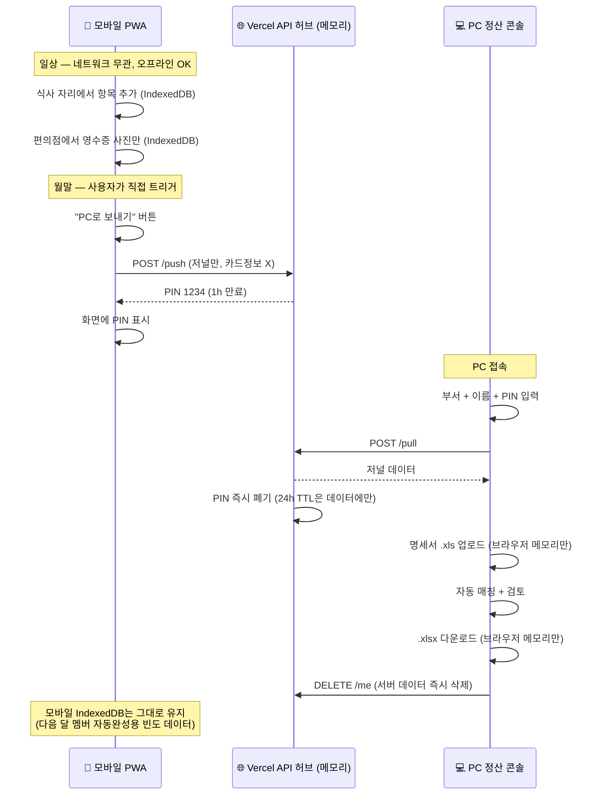
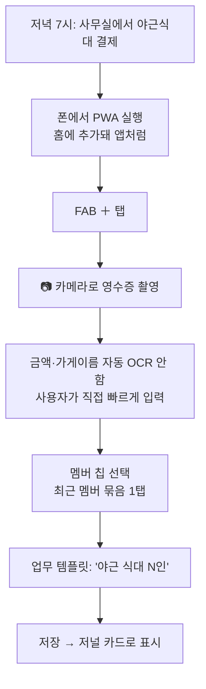
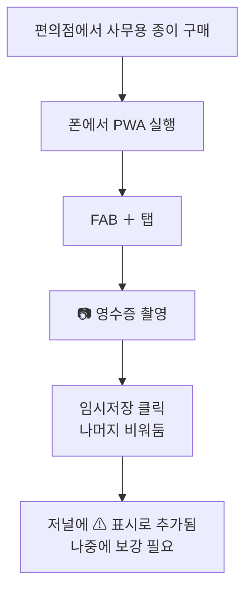
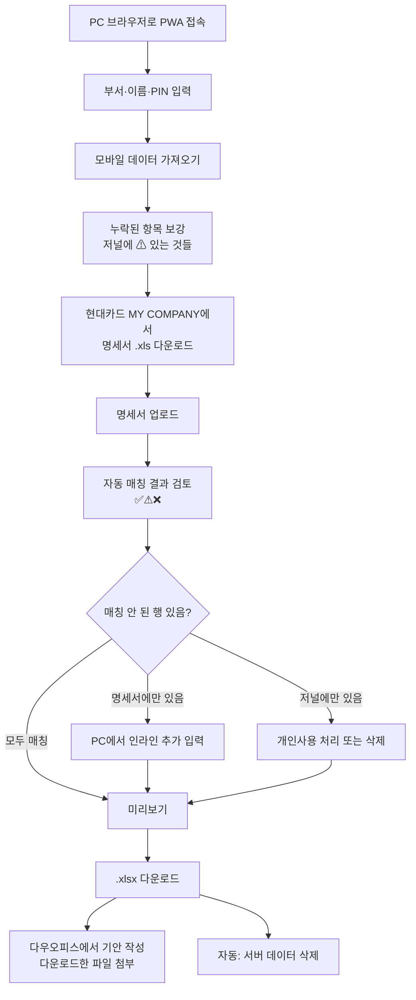

# 02. 사용자 흐름

## 전체 흐름 (한 달 사이클)



## 트리거 원칙: 자동 동기화 X, 사용자 명시적 푸시 1회

| 상황 | 동작 |
|---|---|
| 모바일 입력 시 | IndexedDB만 저장 |
| 네트워크 연결 변화 | 자동 동기화 없음 |
| 사용자 "PC로 보내기" 클릭 | 1회 push, PIN 발급 |
| 사용자가 모바일에서 추가 입력 후 다시 "PC로 보내기" | 새 PIN 발급, 이전 PIN 폐기 |
| PC pull 성공 | PIN 즉시 폐기, 데이터는 24h TTL 유지 |
| PC "다운로드 완료" | DELETE 호출, 서버 데이터 즉시 삭제 |

## 일상 시나리오 — 야근 식대 입력 (30초)



소요시간 목표: **30초 이내**.
빠른 입력의 핵심은 ① 카메라 즉시 호출 ② 멤버 칩 자동완성 ③ 업무 템플릿 ④ 계정 자동 추천.

## 일상 시나리오 — 편의점 영수증만 (10초)



소요시간 목표: **10초**.
멤버·금액·계정 입력은 나중에 미룸. 사진만 잡아두는 게 가치.

## 월말 시나리오 — PC 정산 (5~7분)



## 오프라인/네트워크 오류 시 UX

입력은 항상 가능. PC로 보내기에서 API 요청이 실패하면 일반 전송 실패 안내만 표시한다.

```
┌─────────────────────────────────┐
│ 📤 PC로 보내기                  │
│                                 │
│ ⚠ 보내지 못했어요               │
│   잠시 후 다시 시도해주세요      │
│                                 │
│ [취소]                          │
└─────────────────────────────────┘
```

## 핵심 비기능 요건

- **오프라인 입력**: 사진 촬영·항목 추가는 네트워크 무관
- **새로고침 무손실**: 모든 입력은 IndexedDB 즉시 저장
- **다운로드 후 폐기**: 서버 데이터, 명세서 임시 데이터 모두 즉시 청소
- **모바일 IndexedDB 보존**: 다음 달 멤버 자동완성·통계용. 사용자가 명시적으로 "초기화"할 때만 삭제.
