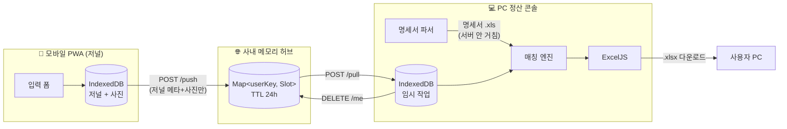

# 03. 아키텍처 / 데이터 분리 원칙

## 핵심 원칙: 서버는 민감 데이터를 보지 않는다



## 데이터 분류

| 데이터 | 발생처 | 서버 경유? | 어디서 처리 |
|---|---|---|---|
| 일자, 가게 메모, 예상 금액 | 모바일 사용자 입력 | ✅ 잠시 | 모바일→서버→PC |
| 함께 식사한 사람 (참가자) | 모바일 사용자 입력 | ✅ 잠시 | 모바일→서버→PC |
| 계정 (복리후생비/회식비/...) | 모바일 사용자 입력 | ✅ 잠시 | 모바일→서버→PC |
| 업무 상세내용 | 모바일 사용자 입력 | ✅ 잠시 | 모바일→서버→PC |
| 영수증 사진 | 모바일 카메라 | ✅ 잠시 | 모바일→서버→PC |
| **카드번호 (마스킹)** | 명세서 .xls | ❌ | PC 브라우저 메모리만 |
| **사업자번호** | 명세서 .xls | ❌ | PC 브라우저 메모리만 |
| **승인번호** | 명세서 .xls | ❌ | PC 브라우저 메모리만 |
| **가맹점 정식명** | 명세서 .xls | ❌ | PC 브라우저 메모리만 |
| **실제 청구금액** | 명세서 .xls | ❌ | PC 브라우저 메모리만 |
| **최종 .xlsx 결과물** | PC 합성 | ❌ | PC 브라우저 메모리만 |

서버가 보는 정보는 사실상 "야근 식대 4인 + 영수증 사진" 수준. 카드 정보 0.

## 컴포넌트 역할

### 📱 모바일 PWA — "저널"
- 일상에서 항목 빠르게 추가
- 영수증 카메라 캡처 (1600px JPEG로 압축)
- IndexedDB에 영구 저장 (사용자가 초기화 전까지)
- "PC로 보내기"로 명시적 1회 푸시

### 🌐 사내 허브 — "잠깐 머무는 우체국"
- 메모리 Map만 사용 (DB 없음)
- 사용자별 슬롯, 24h TTL, PIN 1회용·1h 만료
- 재시작해도 OK (의도된 휘발성)
- 사내망에서만 접근 (인프라 정책)

### 💻 PC 정산 콘솔 — "월말 합치기"
- PC도 같은 PWA. 같은 코드, 다른 라우트
- 모바일 데이터 pull → IndexedDB
- 명세서 .xls 업로드 → 브라우저 메모리에서만 파싱
- 자동 매칭 + 사용자 검토
- ExcelJS로 .xlsx 생성 → 다운로드
- 다운로드 완료 시 서버 DELETE 호출

## 기술 스택

### 프론트엔드 (모바일 + PC 공통, 실제 채택)
- **Vite + React 19 + TypeScript** (Next.js 대신 SPA로 단순화)
- **CSS** (Pretendard, 자체 토큰 — Tailwind 미도입)
- **input-otp** — PIN 4셀 입력 (shadcn 표준)
- **idb-keyval** — IndexedDB 사진 저장
- **ExcelJS** — .xlsx 생성 + 이미지 임베드
- **SheetJS (xlsx)** — 명세서 .xls 읽기
- **vite-plugin-pwa** — manifest + Workbox SW 자동 생성

### 백엔드 (사내 허브)
- **Bun + Hono** — 단일 바이너리, 가볍고 빠름
- **메모리 `Map<userKey, Slot>`** — DB 없음, 60초 GC
- **Hono `c.req.formData()`** — multipart 처리

### 배포
- 정적 PWA 산출물 + Bun 서버를 **같은 호스트에 함께 띄움**
- 한 포트, 한 프로세스
- HTTPS는 사내 인프라팀에서 처리
- 도메인은 추후 인프라팀 협의

## 모노레포 구조 (실제)

```
exem-payment-automation/
├── docs/                       # 설계 문서 (이 폴더)
├── rules/
│   └── 2026-current.json       # 룰 엔진 원본 (PR 단위 갱신)
├── apps/
│   ├── web/                    # Vite + React SPA + PWA
│   │   ├── public/
│   │   │   ├── icon.svg
│   │   │   ├── icon-maskable.svg
│   │   │   └── manifest.webmanifest
│   │   └── src/
│   │       ├── App.tsx                # 단일 SPA (모드 자동 분기)
│   │       ├── Onboarding.tsx         # 첫 진입 풀스크린
│   │       ├── data.ts                # 룰 import + TEAM_MEMBERS + 매칭
│   │       ├── api.ts                 # /api/health, push, pull, photos, me
│   │       ├── db.ts                  # 사진 IndexedDB(idb-keyval) + 압축
│   │       ├── xlsx.ts                # ExcelJS 4 시트 + 8슬롯 anchor
│   │       └── styles.css
│   └── hub/                    # Bun + Hono
│       └── src/
│           ├── index.ts               # Hono 라우트 + 정적 서빙
│           └── store.ts               # 메모리 Map + TTL
└── packages/
    └── shared/                 # 공통 타입/sanitizer/룰 헬퍼
        ├── rules.json                 # 번들용 룰(웹에서 import)
        └── src/
            ├── types.ts               # JournalEntry, StatementRow 등
            ├── sanitize.ts            # 화이트리스트 sanitizer
            ├── rules.ts               # pickAccount, validateForExport 등
            └── index.ts
```

`apps/web`과 `apps/hub`는 서로 다른 런타임(Vite/Node, Bun)이지만 `@exem/shared`로 타입과 sanitizer·룰 헬퍼를 공유.

## 라우팅 (실제)

라우터는 사용하지 않는다. SPA 단일 화면이며 디바이스 분기와 step 상태만으로 화면을 결정한다.

- `App` → 모드 자동 판정(`pointer: coarse` 또는 폭 < 920) → `JournalScreen` 또는 `SyncFunnel`
- 첫 진입에 `localStorage.exem-profile`이 없으면 `OnboardingScreen` 풀스크린
- 모바일 모달은 모두 Bottom Sheet(EntrySheet/SettingsSheet/PinRevealModal)
- PC `SyncFunnel` 안에서 step state(`pull → statement → match → download → done`)로 한 단계씩 슬라이드

## 빌드 / 배포 (실제)

```sh
# 개발 (두 프로세스)
pnpm dev:hub      # Bun :4174
pnpm dev:web      # Vite :5173 (/api → :4174 프록시)

# 운영 (단일 프로세스)
pnpm build        # apps/web/dist + manifest + sw 생성
pnpm start        # Bun이 정적(/) + /api 모두 :4174로 서빙
```

사내 인프라 측에서:
- 리버스 프록시(nginx 등)에서 HTTPS 종단
- 사내망 IP 접근 정책
- 도메인 매핑
